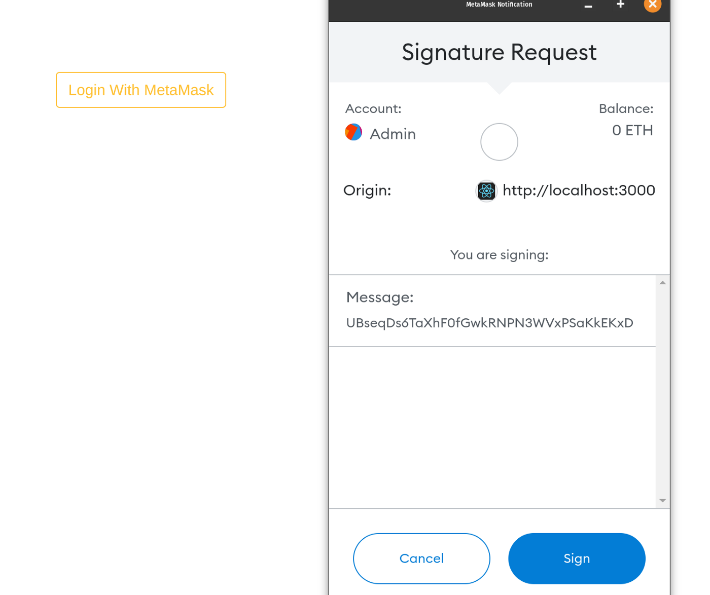

## Installation

first clone this repo

### Backend

```
cd backend/
pip install -r requirements.txt
python manage.py runserver
```

this will start the Django server on http://127.0.0.1:8000/ you will see swagger UI


### Frontend
open a new terminal

```
cd frontend/
yarn install
yarn start
```

this will start the react server on  http://localhost:3000/

if you are geting CROS origin error please use this [extension](https://chrome.google.com/webstore/detail/moesif-origin-cors-change/digfbfaphojjndkpccljibejjbppifbc)



### how it works?

check out [this blog](https://manaanansari.medium.com/login-with-metamask-using-python-django-340110ae2020)
